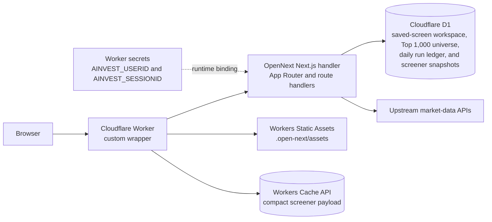
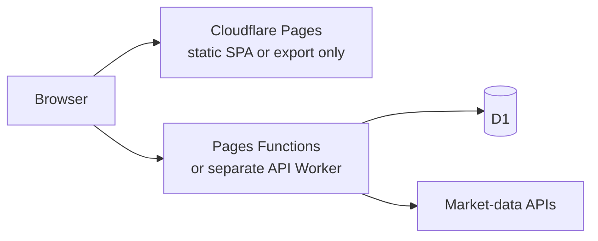

# Cloudflare architecture

## Decision

Deploy this repository as a **Cloudflare Worker with Static Assets and D1**,
using Cloudflare's supported full-stack Next.js adapter,
[`@opennextjs/cloudflare`](https://opennext.js.org/cloudflare).

The standard Next.js build is packaged by OpenNext as a Worker handler and a
static-asset directory. `worker/index.ts` wraps that generated handler so the
same deployment can apply API rate limits, run trading-day anonymous-session
cleanup, publish a durable pre-open screener snapshot, and refresh the Top 1,000
market-cap universe on the last day of each month. Wrangler deploys the wrapper,
the OpenNext application, Static Assets, D1 bindings, rate-limit bindings, the
market-data secrets, and both Cron Triggers as one Worker service.

Do not deploy the current application as a static Cloudflare Pages project.
Cloudflare's [Next.js Pages guide](https://developers.cloudflare.com/pages/framework-guides/nextjs/)
directs full-stack Next.js applications to Workers and limits the Pages path to
static export. This application is not a static export: it has server-rendered
App Router routes, dynamic API route handlers, server-side upstream calls, a
secret credential, D1 access, and scheduled work. Cloudflare documents the
supported full-stack path in its
[Next.js on Workers guide](https://developers.cloudflare.com/workers/framework-guides/web-apps/nextjs/).

A domain that was intended for Pages can be attached to the Worker. The product
mismatch is about the Cloudflare deployment resource, not the public URL:
Workers Static Assets provides the CDN-backed frontend delivery that this
application needs while keeping the Next.js server and APIs in the same
deployment.

## Topology



All browser requests remain same-origin. That keeps anonymous workspace cookies
simple and allows mutation routes to reject cross-origin requests.

## Implemented components

| Layer | Technology | Responsibility |
| --- | --- | --- |
| UI and routes | Next.js App Router and React | Screens, React Server Components, client interactions, and route composition |
| Next.js adapter | `@opennextjs/cloudflare` | Packages the Next.js server as `.open-next/worker.js` and browser assets as `.open-next/assets` |
| Edge runtime | Cloudflare Worker | Dynamic rendering, API execution, secret access, D1 access, rate limiting, a five-minute compact-snapshot cache, trading-day pre-open refresh, scheduled cleanup and universe refresh, and static-asset dispatch |
| Static delivery | Workers Static Assets | Serves the OpenNext asset output from the Worker deployment |
| API | Next.js route handlers | Security summary, series, peers, valuation analysis, business quality, screener, and saved-screener workspace CRUD |
| Database | Cloudflare D1 with Drizzle ORM | Anonymous sessions, saved screener definitions, the monthly Top 1,000 universe, immutable screener generations, and the per-trading-date execution ledger |
| Schema migrations | Drizzle SQL applied by Wrangler | Repeatable local and remote D1 setup |
| Market data | Server-side `fetch` from the Worker | Sends a manually rotated upstream session without exposing it to the browser |

The relevant project configuration is:

- `open-next.config.ts`: OpenNext's Cloudflare build configuration.
- `next.config.ts`: initializes the OpenNext Cloudflare development context so
  `next dev` can access local bindings.
- `wrangler.jsonc`: Worker entry point, compatibility flags, Static Assets
  binding, OpenNext's `WORKER_SELF_REFERENCE` service binding, D1 binding, API
  rate-limit bindings, Cron Triggers, and observability.
- `worker/index.ts`: wraps the generated OpenNext handler, applies rate limits,
  deletes expired anonymous workspaces, publishes the trading-day D1 screener
  snapshot before the New York market opens, and refreshes the market-cap
  universe on the last day of each month.
- `lib/market-calendar.ts` and `lib/screener/schedule.ts`: convert Cloudflare's
  UTC candidate schedule to New York time and admit only 08:00, 08:30, and
  09:00 on supported NYSE trading days.
- `lib/screener/daily-refresh.ts`: claims one leased D1 run per New York trading
  date, retries failed or expired attempts, and makes successful repeats no-op.
- `lib/screener/universe.ts`: validates, reads, initializes, and replaces the
  ranked Top 1,000 universe stored in D1.
- `lib/screener/snapshot.ts`: validates and stores immutable detailed screener
  generations plus their compact client payload before atomically making one
  active.
- `db/schema.ts` and `drizzle/`: Drizzle schema and D1 migration.
- `db/index.ts`: creates the Drizzle client from the `DB` binding exposed by
  OpenNext's Cloudflare context.

Cloudflare also supports D1 bindings in
[Pages Functions](https://developers.cloudflare.com/pages/functions/bindings/),
but that does not make a dynamic Next.js application a Pages static export. It
is relevant only to the split alternative described below.

## Runtime request flows

### Public analysis

1. The browser requests a page or an `/api/security` or `/api/screener`
   endpoint.
2. The custom Worker wrapper applies coarse per-client-IP limits to the public
   security and screener API families, then delegates to OpenNext.
3. The route handler validates the exchange, symbol, query, and filter inputs.
4. Security-analysis routes use the server-only `AINVEST_USERID` and
   `AINVEST_SESSIONID` Worker secrets to construct the C-side AInvest cookie.
5. If AInvest rejects the session as expired, the server invalidates that session
   and fails closed; an operator must manually rotate both secrets.
6. For `/api/screener/snapshot`, the Worker first checks its five-minute Cache
   API entry. On a miss, the route reads one active generation record from D1
   and returns its validated compact JSON with a stable ETag. Successful
   current-schema responses are cached; errors and rollout-bridge responses
   using the prior filter schema are not. The browser and Worker cache key both
   include the current schema version. Normal requests do not contact AInvest
   or read the 1,000 detailed row records. A generation created before compact
   payloads existed is rebuilt once from those stored D1 rows without an
   upstream request. Readers accept filter-mask schemas one through three;
   only schema-three responses use the current cache key.
7. The browser downloads that compact validated generation once. Every filter
   has a precomputed membership bit, so filter combinations, sorting, columns,
   pagination, and saved-screen changes are applied locally without another API
   request. Schema two added stored memberships for FCF yield, EV / EBITDA,
   cash conversion, ROIC, and net debt / FCF. Schema three tightens margin of
   safety to 20%, requires a positive P/E no greater than 15×, and raises FCF
   yield to 5%; it also retires the session-momentum and debt/equity controls.
   Prior-schema generations remain readable during refresh, while incompatible
   controls stay hidden. If no
   active generation exists, the public endpoint returns a
   provider-neutral unavailable response without contacting AInvest; only the
   scheduled refresh or an explicit administrative seed can publish one.
8. Other server modules normalize source data and calculate canonical
   valuation, ratios, and scoring for security-analysis routes.
9. The API returns a provider-neutral response. Missing data remains `null`
   with provenance or reason metadata rather than being invented in the
   browser.

### Scheduled maintenance

1. Cloudflare invokes `0,30 12-14 * * mon-fri` in UTC. The Worker converts the
   scheduled instant to `America/New_York` and accepts only 08:00, 08:30, or
   09:00 on a supported NYSE trading day. This fixed UTC candidate grid remains
   DST-safe; the unused candidates exit without work. The three accepted times
   provide retries before the 09:30 core market open.
2. An accepted attempt atomically leases that New York trading date in
   `screener_snapshot_daily_runs`. The first successful attempt fetches the
   scoped Top 1,000 details in bounded batches, derives canonical valuation and
   five-year operating-margin metrics, normalizes ROIC, EV / EBITDA, and net
   debt, and writes deterministic generation `daily-YYYY-MM-DD`. Duplicate
   attempts no-op after success; failed or expired leases may be reclaimed.
3. Exact membership, required indicator descriptors, row count, and minimum
   input coverage are validated before the generation rows, active pointer, and
   daily-run completion commit in one D1 batch. A failed refresh leaves the
   prior snapshot active, and generations referenced by the daily ledger are
   retained instead of entering short-term cleanup.
4. The `47 3 L * *` trigger runs on the last day of each month. It fetches the
   market-cap ranking from AInvest, requires exactly 1,000 unique valid
   securities, and replaces the D1 `top_market_cap_universe` rows. Snapshot
   publication remains owned by the next accepted trading-day run.
5. Each stored universe row contains its market code, routed exchange, ticker,
   market cap, rank, and refresh timestamp. The immutable snapshot rows store
   normalized metrics plus the precomputed filter mask in generation-scoped
   rows. The generation record also carries a schema-versioned compact JSON
   payload and content hash for client delivery.

### Anonymous workspace

1. A saved-screener workspace request receives or creates a random 256-bit
   opaque session token.
2. The browser gets the token as an `HttpOnly`, `SameSite=Lax` cookie, with
   `Secure` added on HTTPS.
3. Only the token's SHA-256 digest is stored in D1.
4. Saved-screener rows are scoped to that digest.
5. Mutation routes require a same-origin `Origin` and cap JSON request bodies.
6. A saved screener persists only its name, filter definition, visible columns,
   and sort choice; it does not store result membership or comparison symbols.
7. The accepted pre-open trading-day job deletes expired sessions; foreign-key
   cascades remove their saved-screener rows.

This is anonymous persistence, not authentication. It does not provide account
recovery, cross-device sync, or access-control guarantees against someone who
possesses the browser cookie.

The historical `security_journal` table remains in the schema and migration
history so existing rows are not destructively deleted. There is no active
journal UI or API, and the application does not write new journal rows.

## Configuration and deployment

### Prerequisites

- Node.js `>=22.13.0`
- A Cloudflare account authenticated with Wrangler
- A valid AInvest account and permission to use and redistribute the provider's
  data

The checked-in `database_id` in `wrangler.jsonc` points to the provisioned
`value-investment` D1 database. A deployment to the current Cloudflare account
requires:

1. Install dependencies and authenticate:

   ```bash
   npm install
   npx wrangler login
   ```

   For a different Cloudflare account, create a D1 database with
   `npx wrangler d1 create value-investment` and replace the checked-in
   `database_id` with the new ID.

2. Regenerate Cloudflare binding types and apply the migration:

   ```bash
   npm run cf:typegen
   npm run db:migrate:remote
   ```

3. Add the manually acquired upstream session identifiers as Worker secrets:

   ```bash
   npx wrangler secret put AINVEST_USERID
   npx wrangler secret put AINVEST_SESSIONID
   ```

   Use a
   [Worker secret](https://developers.cloudflare.com/workers/configuration/secrets/),
   not a plaintext `vars` value or a browser environment variable. Rotate both
   values together when AInvest rejects the session.

4. Build and verify the Worker locally:

   ```bash
   npm test
   npm run preview
   ```

5. Deploy:

   ```bash
   npm run deploy
   ```

6. Smoke-test the deployed summary, valuation, business-quality, screener, and
   saved-screener read/write/delete flows before attaching the production
   domain.

For local development:

```bash
npm run db:migrate:local
npm run dev
```

Store `AINVEST_USERID` and `AINVEST_SESSIONID` in the ignored `.dev.vars` file.
Do not use `.env.local` for these values: OpenNext compiles `.env*` values into
its Worker output during a production build. The application does not automate
email/password login because AInvest requires an interactive email-certification
step.

`npm run build` creates the normal Next.js build. `npm run build:worker`
creates the deployable `.open-next` Worker and asset output. `npm run preview`
and `npm run deploy` rebuild that OpenNext output before previewing or
deploying it.

## Production hardening still required

- The durable screener snapshot prioritizes instant interaction and consistent
  filter membership over intraday quote ticks. If intraday screener quotes
  become a requirement, add a separate lightweight scheduled quote generation
  rather than returning provider calls to the public request path.
- Revisit the initial rate policy (120 security requests and 30 screener
  requests per minute per connecting IP) against real traffic. Cloudflare's
  [Workers rate-limiting binding](https://developers.cloudflare.com/workers/runtime-apis/bindings/rate-limit/)
  is intentionally permissive and local. Replace the coarse IP key with an
  authenticated account or Cloudflare Access identity if the product gains an
  identity model.
- Monitor upstream timeouts, rejected sign-ins, D1 errors, and scan freshness.
  AInvest risk challenges such as CAPTCHA cannot be completed inside a Worker;
  authentication fails closed without repeatedly attempting the password.
- Verify the market-data provider's terms, licensing, attribution, caching, and
  redistribution requirements before launch. The technical secret boundary
  does not grant data-use rights.
- Avoid caching personalized `/api/workspace/*` responses. Cache public
  analysis only when its source freshness and credential behavior are
  understood.
- The business-quality endpoint currently composes several upstream-backed
  services, including overlapping peer work. Consolidate duplicate fetches if
  latency or upstream quotas become material.

## If Cloudflare Pages is non-negotiable

Pages can still host a browser shell, but the application must be split and is
no longer this repository's current deployment architecture:



Required changes:

1. Convert the frontend to a true static export or a Vite SPA. Dynamic symbol
   routes must be client-routed or pre-generated; the current server-rendered
   App Router build cannot be copied to Pages unchanged.
2. Move every `/api/*` handler into Pages Functions or, preferably for minimal
   coupling, a separate Cloudflare Worker.
3. Bind D1 and the market-data login secrets to that function or Worker
   runtime.
4. Keep the API same-origin if possible. If it uses another hostname, add a
   strict CORS allowlist and redesign the cookie and CSRF boundary deliberately.
5. Update the frontend's relative `/api/...` calls and deployment tests.

Pages Functions support D1, and Wrangler can configure
[Pages bindings](https://developers.cloudflare.com/pages/functions/wrangler-configuration/).
However, this split adds a second build and deployment surface, gives up the
current full-stack route integration, and requires a separate static-routing
strategy. Unless the Pages product itself is a hard requirement, one Worker
with Static Assets is the simpler and Cloudflare-supported deployment for this
repository. Cloudflare documents the relationship and migration path in its
[Pages-to-Workers guide](https://developers.cloudflare.com/workers/static-assets/migration-guides/migrate-from-pages/).
