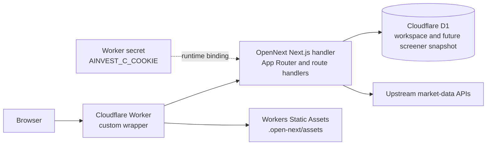
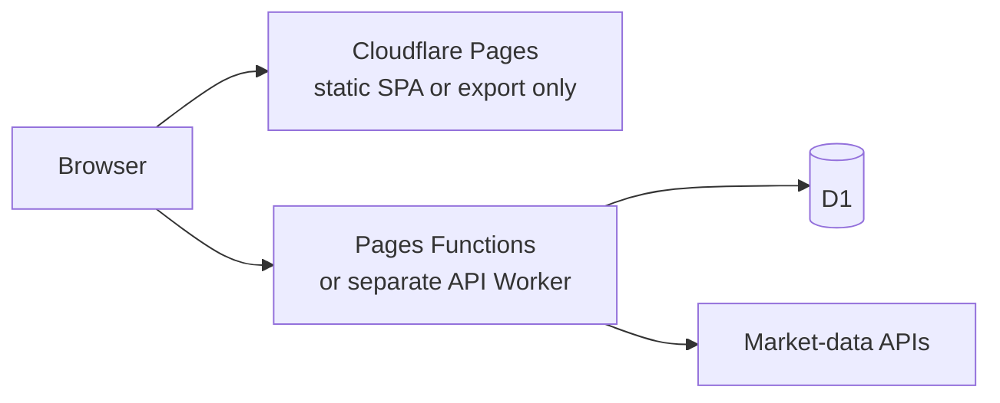

# Cloudflare architecture

## Decision

Deploy this repository as a **Cloudflare Worker with Static Assets and D1**,
using Cloudflare's supported full-stack Next.js adapter,
[`@opennextjs/cloudflare`](https://opennext.js.org/cloudflare).

The standard Next.js build is packaged by OpenNext as a Worker handler and a
static-asset directory. `worker/index.ts` wraps that generated handler so the
same deployment can apply API rate limits and run the daily anonymous-session
cleanup. Wrangler deploys the wrapper, the OpenNext application, Static Assets,
D1 bindings, rate-limit bindings, the market-data secret, and the Cron Trigger
as one Worker service.

Do not deploy the current application as a static Cloudflare Pages project.
Cloudflare's [Next.js Pages guide](https://developers.cloudflare.com/pages/framework-guides/nextjs/)
directs full-stack Next.js applications to Workers and limits the Pages path to
static export. This application is not a static export: it has server-rendered
App Router routes, dynamic API route handlers, server-side upstream calls, a
secret credential, D1 access, and scheduled work. Cloudflare documents the
supported full-stack path in its
[Next.js on Workers guide](https://developers.cloudflare.com/workers/framework-guides/web-apps/nextjs/).

A domain that was intended for Pages can be attached to the Worker. The product
mismatch is about the Cloudflare deployment resource, not the public URL:
Workers Static Assets provides the CDN-backed frontend delivery that this
application needs while keeping the Next.js server and APIs in the same
deployment.

## Topology



All browser requests remain same-origin. That keeps anonymous workspace cookies
simple and allows mutation routes to reject cross-origin requests.

## Implemented components

| Layer | Technology | Responsibility |
| --- | --- | --- |
| UI and routes | Next.js App Router and React | Screens, React Server Components, client interactions, and route composition |
| Next.js adapter | `@opennextjs/cloudflare` | Packages the Next.js server as `.open-next/worker.js` and browser assets as `.open-next/assets` |
| Edge runtime | Cloudflare Worker | Dynamic rendering, API execution, secret access, D1 access, rate limiting, scheduled cleanup, and static-asset dispatch |
| Static delivery | Workers Static Assets | Serves the OpenNext asset output from the Worker deployment |
| API | Next.js route handlers | Security summary, series, peers, valuation analysis, business quality, screener, and workspace CRUD |
| Database | Cloudflare D1 with Drizzle ORM | Anonymous sessions, notes/stance/watch prices, saved screener definitions, and saved baseline symbols |
| Schema migrations | Drizzle SQL applied by Wrangler | Repeatable local and remote D1 setup |
| Market data | Server-side `fetch` from the Worker | Keeps the upstream cookie out of the browser |

The relevant project configuration is:

- `open-next.config.ts`: OpenNext's Cloudflare build configuration.
- `next.config.ts`: initializes the OpenNext Cloudflare development context so
  `next dev` can access local bindings.
- `wrangler.jsonc`: Worker entry point, compatibility flags, Static Assets
  binding, OpenNext's `WORKER_SELF_REFERENCE` service binding, D1 binding, API
  rate-limit bindings, Cron Trigger, and observability.
- `worker/index.ts`: wraps the generated OpenNext handler, applies rate limits,
  and deletes expired anonymous workspaces on the daily Cron Trigger.
- `db/schema.ts` and `drizzle/`: Drizzle schema and D1 migration.
- `db/index.ts`: creates the Drizzle client from the `DB` binding exposed by
  OpenNext's Cloudflare context.

Cloudflare also supports D1 bindings in
[Pages Functions](https://developers.cloudflare.com/pages/functions/bindings/),
but that does not make a dynamic Next.js application a Pages static export. It
is relevant only to the split alternative described below.

## Runtime request flows

### Public analysis

1. The browser requests a page or an `/api/security` or `/api/screener`
   endpoint.
2. The custom Worker wrapper applies coarse per-client-IP limits to the public
   security and screener API families, then delegates to OpenNext.
3. The route handler validates the exchange, symbol, query, and filter inputs.
4. Server code calls the upstream market-data service using the
   `AINVEST_C_COOKIE` Worker secret.
5. Server modules normalize source data and calculate canonical valuation,
   ratios, scoring, and screener results.
6. The API returns a provider-neutral response. Missing data remains `null`
   with provenance or reason metadata rather than being invented in the
   browser.

### Anonymous workspace

1. A workspace request receives or creates a random 256-bit opaque session
   token.
2. The browser gets the token as an `HttpOnly`, `SameSite=Lax` cookie, with
   `Secure` added on HTTPS.
3. Only the token's SHA-256 digest is stored in D1.
4. Journal and screener rows are scoped to that digest.
5. Mutation routes require a same-origin `Origin` and cap JSON request bodies.
6. Saved-screener definitions and baseline chunks are committed in one D1
   batch, and each insert stays below D1's bound-parameter limit.
7. A daily Cron Trigger deletes expired sessions; foreign-key cascades remove
   their workspace rows.

This is anonymous persistence, not authentication. It does not provide account
recovery, cross-device sync, or access-control guarantees against someone who
possesses the browser cookie.

## Configuration and deployment

### Prerequisites

- Node.js `>=22.13.0`
- A Cloudflare account authenticated with Wrangler
- A valid upstream market-data cookie and permission to use and redistribute
  the provider's data

The checked-in `database_id` in `wrangler.jsonc` is a non-working placeholder.
A real deployment requires:

1. Install dependencies and create D1:

   ```bash
   npm install
   npx wrangler login
   npx wrangler d1 create value-investment
   ```

2. Replace the placeholder `database_id` in `wrangler.jsonc` with the ID
   returned by Wrangler.
3. Regenerate Cloudflare binding types and apply the migration:

   ```bash
   npm run cf:typegen
   npm run db:migrate:remote
   ```

4. Add the upstream credential as a Worker secret:

   ```bash
   npx wrangler secret put AINVEST_C_COOKIE
   ```

   Use a
   [Worker secret](https://developers.cloudflare.com/workers/configuration/secrets/),
   not a plaintext `vars` value or a browser environment variable.

5. Build and verify the Worker locally:

   ```bash
   npm test
   npm run preview
   ```

6. Deploy:

   ```bash
   npm run deploy
   ```

7. Smoke-test the deployed summary, valuation, business-quality, screener, and
   workspace read/write/delete flows before attaching the production domain.

For local development:

```bash
npm run db:migrate:local
npm run dev
```

`npm run build` creates the normal Next.js build. `npm run build:worker`
creates the deployable `.open-next` Worker and asset output. `npm run preview`
and `npm run deploy` rebuild that OpenNext output before previewing or
deploying it.

## Production hardening still required

- Replace the in-memory full-universe screener cache with a scheduled
  Worker/Queue refresh and a durable, generation-based D1 snapshot. Disposable
  isolates cannot provide a shared global cache.
- Revisit the initial rate policy (120 security requests and 30 screener
  requests per minute per connecting IP) against real traffic. Cloudflare's
  [Workers rate-limiting binding](https://developers.cloudflare.com/workers/runtime-apis/bindings/rate-limit/)
  is intentionally permissive and local. Replace the coarse IP key with an
  authenticated account or Cloudflare Access identity if the product gains an
  identity model.
- Monitor upstream timeouts, credential expiry, D1 errors, and scan freshness.
- Verify the market-data provider's terms, licensing, attribution, caching, and
  redistribution requirements before launch. The technical secret boundary
  does not grant data-use rights.
- Avoid caching personalized `/api/workspace/*` responses. Cache public
  analysis only when its source freshness and credential behavior are
  understood.
- The business-quality endpoint currently composes several upstream-backed
  services, including overlapping peer work. Consolidate duplicate fetches if
  latency or upstream quotas become material.

## If Cloudflare Pages is non-negotiable

Pages can still host a browser shell, but the application must be split and is
no longer this repository's current deployment architecture:



Required changes:

1. Convert the frontend to a true static export or a Vite SPA. Dynamic symbol
   routes must be client-routed or pre-generated; the current server-rendered
   App Router build cannot be copied to Pages unchanged.
2. Move every `/api/*` handler into Pages Functions or, preferably for minimal
   coupling, a separate Cloudflare Worker.
3. Bind D1 and the market-data secret to that function or Worker runtime.
4. Keep the API same-origin if possible. If it uses another hostname, add a
   strict CORS allowlist and redesign the cookie and CSRF boundary deliberately.
5. Update the frontend's relative `/api/...` calls and deployment tests.

Pages Functions support D1, and Wrangler can configure
[Pages bindings](https://developers.cloudflare.com/pages/functions/wrangler-configuration/).
However, this split adds a second build and deployment surface, gives up the
current full-stack route integration, and requires a separate static-routing
strategy. Unless the Pages product itself is a hard requirement, one Worker
with Static Assets is the simpler and Cloudflare-supported deployment for this
repository. Cloudflare documents the relationship and migration path in its
[Pages-to-Workers guide](https://developers.cloudflare.com/workers/static-assets/migration-guides/migrate-from-pages/).
